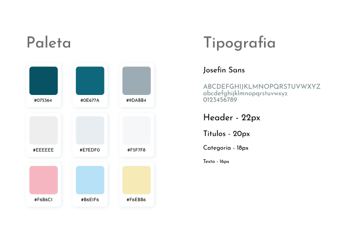
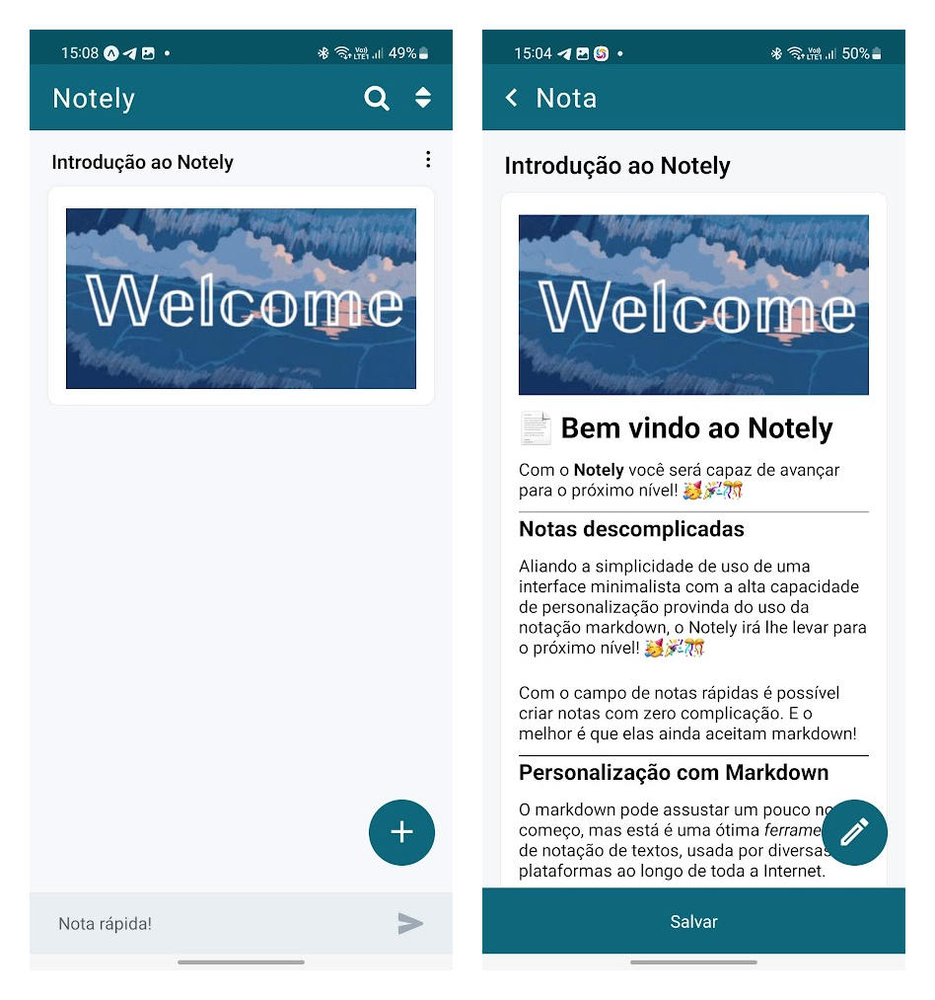

<h1 style="font-size: 38px; font-weight: 500; letter-spacing: 1.5px; text-align: center">Notely</h1>

## Sobre o Notely

O **Notely** é um sistema otimizado de criação e gestão de notas personalizadas através da notação de markdown, que permite uma maior produtividade por aliar simplicidade, organização e personalização.

Atualmente existem diversos sistemas de gestão de notas no mercado, e muitos conseguem aglutinar diversas funcionalidades disponibilizadas para seus usuários. Contudo, por muitas vezes, a maximização de uma determinada área necessariamente leva a um prejuízo em outras. Assim, muitos desses sistemas possuem ferramentas quase inutilizadas pela larga maioria dos usuários, que só atribuem mais complexidade para o sistema e geram mais sobrecarga de informações em termos de usabilidade, prejudicando ambos o desempenho do usuário e do próprio sistema.

Em muitas ocasiões os usuários preferem utilizar sistemas não voltados para notas, como um grupo no WhatsApp ou o chat de mensagens salvas no Telegram. Isso se dá, pois, mesmo com as limitações de personalização e filtragem, estes sistemas são diretos quando se trata do processo de abrir o app, escrever a nota e salvá-la. Por isso o **Notely** conta com o sistema de Notas rápidas sempre disponível para todos os usuários.

Por fim, a questão da personalização também é importante em vários aspectos. Acontece que em determinados casos sequer é possível deixar determinados termos das notas em negrito, ou criar linhas verticais para separar conteúdos. Por isso, o sistema do **Notely** sustenta interpretação de notação markdown de forma nativa, o que permite interpretação das notas com estilos padronizados, mesmo que estas sejam armazenadas na forma de texto puro, o que economiza armazenamento.

---

## Inspirações

**TickTick**: Este sistema de gestão de tarefas possui um ótimo sistema de notas descritivas baseado em markdown, o que permite muito mais personalização das descrições das tarefas. Ainda, por ser um sistema de interpretação simultânea, este consegue ser ainda mais responsivo e otimizado que o normal.

**Notion**: Este por sua vez se trata de um sistema All-in-one, que dá suporte para quase todo tipo de ferramentas em termos de organização de conteúdos. Por ser muito abrangente, não é tão indicado para servir simplesmente como um sistema de notas, mas no geral pode contribuir com insights para estes.

**Google Keep**: O serviço de notas da Google é extremamente utilizado, e por isso deve ser tomado como um referencial dentro da área. Contudo, este ainda peca em não ser tão otimizado e não suportar quaisquer formas de personalização das notas.

**Docs**: Também uma ferramenta da Google, este é o oposto do Keep, no sentido de que permite uma personalização extrema dos documentos escritos. Contudo, este já adota uma característica demasiado robusta para servir como um sistema de notas, sendo ainda menos otimizado e focado em usabilidade.

**Mensageiros**: Como mencionado anteriormente, sistemas como o _WhatsApp_ e _Telegram_ não se enquadram como sistemas de notas, mas diversos usuários se aproveitam de sua simplicidade para armazenar informações nos mesmos. É importante citar que estes se encontram entre os sistemas de melhor usabilidade, mas não contam com tantas ferramentas voltadas para a organização das notas.

---

## Tecnologias Usadas

<p align="left">


<!--  -->
</p>

Além das tecnologias descritas nas badges, ainda foram usadaos a plataforma da _Expo_ para rodar a aplicação, além das bibliotecas _React Navigation_ e _React Native Markdown Display_, para realizar a navegação entre telas e a renderização dos elementos Markdown respectivamente.

---

## Próximos passos

Estes são alguns dos próximos desafios de implementação do sistema. É importante sempre considerar a relação Facilidade/Importância, para que o desenvolvimento seja focado no que é mais simples e principalmente mais importante para a concretização de uma boa ferramenta de notas.

- [x] Ajeitar a splashscreen e o ícone do aplicativo
- [x] Resolver o problema da barra de ferramentas ficar em cima no input multiline
- [x] Desmarcar um elemento caso ele já esteja marcado com uma notação markdown e o usuário selecionar e tocar no mesmo marcador
- [ ] Criar uma scrollbar grande e redonda para ser fácil navegar, e deixar ela invisível quando não estiver acontecendo scroll
- [ ] Utilizar o SQLite para permitir o armazenamento dos dados localmente no dispositivo dos usuários
- [ ] Criar lixeira para notas apagadas para permitir visualizar e/ou recuperar notas apagadas (Organizar como Favoritas, Geral e Apagadas)
- [ ] Sistema de tags/cadernos (Será necessário criar formas de criar, apagar, atribuir, remover e filtrar as tags/cadernos)
- [ ] Permitir o armazenamento das notas dos usuários em um servidor externo
- [ ] Adicionar um local de configurações onde o usuário pode dizer o tamanho dos cards (escolher um valor fixo, tamanho ajustável)
- [ ] Criar um tema escuro para o aplicativo e permitir alterar
- [ ] Visualização em blocos (Duas notas por linha)
- [ ] Visualização de listas (A nota fica apenas com o título, ocultando o conteúdo)
- [ ] Adicionar mais opções no menu das notas (Compartilhar nota...)
- [ ] Seleção múltipla de notas com onLongPress
- [ ] Expansão e retração das notas na Home
- [ ] Manipulação de notas com drag and drop (Ordenamento personalizado)
- [ ] Notas criptografadas
- [ ] Autodestruição da nota com timer
- [ ] Permitir bloqueio do app com senha ou biometria (LocalAuthentication)
- [ ] Adicionar novos tipos de estilização: sublinhado, grifado, checklist (markdown-it-task-lists), dropdown (markdown-it-container), tab, retornar, avançar
- [ ] Permitir a navegação entre notas indo para a próxima ou anterior simplesmente arrastando para os lados quando estão abertas
- [ ] Criar um sistema para receber informações de edição como um modal para texto e link, ou para link da imagem, ou para selecionar o tipo de título
- [ ] Adicionar markdown de forma dinâmica de acordo com as inserções do usuário
- [ ] Exibição do markdown de forma simultânea no input (Como nas anotações do TickTick, pode tentar alternar entre as duas telas em uma alta frequência)
- [ ] Permitir a escrita e interpretação de material no formato LaTeX (User plugins ou extensões do markdown-it)
- [ ] Permitir o usuário dar check em itens do checklist (Não sei se é possível, mas o TickTick e Notion conseguem)
- [ ] Resolver o problema das quebras de linha ignoradas
- [ ] Permitir a estilização das notas (Tamanho da fonte, família da fonte, cor da fonte, cor do background)
- [ ] Adicionar suporte multimídia com dados do dispositivo (Áudio, imagem, vídeo, desenho, documentos, transcrição de áudio)
- [ ] Trocar os Alert por modais personalizados do sistema
- [ ] Criar sistema de dropdown dentro dos campos de Favoritas, Geral e Apagadas
- [ ] Otimizar a performance do sistema evitando fluxo de dados e atualizações de componentes de forma desnecessária
- [ ] Usar importação dinâmica para aumentar a escalabilidade do projeto

---

## Estrutura do Projeto

```bash
├───components
├───context
├───interface
├───screens
│   ├───Home
│   │   └───components
│   └───Nota
│       └───components
├───service
├───styles
└───utils
```

**Components**: Componentes compartilhados entre ambas as telas de Home e Nota.

**Context**: Configuração dos estados e funções globais compartilhados por todos os componentes.

**Interface**: Interfaces e tipos usados ao longo do projeto.

**Screens**: Local onde se encontram as duas telas da aplicação, respectivamente _Home_ e _Nota_. A tela _Home_ é responsável pela exibição da tela inicial, na qual estão contidas as notas salvas, e ela é composta por outros componentes armazenados no diretório _components_. Já a tela _Nota_ por sua vez se trata da interface de visualização e edição das notas, sendo também composta por outros componentes presentes no diretório _components_.

**Styles**: Armazena as cores e definições das StyleSheets dos componentes.

**Utils**: Trata das ferramentas adicionais usadas ao longo da aplicação, tais como os geradores de id e título.

---

## Nota

- **id**: Valor numérico único da nota (fixo)
- **titulo**: Texto exibido no título das notas (variável)
- **texto**: Texto exibido no copo das notas (variável)
- **favorito**: Valor booleano que indica se a nota é ou não favorita
- **criacao**: Timestamp de criação da nota (fixo)
- **modificacao**: Timestamp de modificação da nota (variável)

---

## Estados Globais

- **notas**: Array de notas do tipo INota.
- **adicionaNota**: Recebe uma nota e a adiciona no array de notas.
- **atualizaNota**: Recebe a nova versão de uma nota existente e a atualiza dentro do array de notas.
- **apagarNota**: Recebe uma nota e a remove no array de notas.
- **favoritosNota**: Recebe uma nota existente e inverte o valor de seu favorito dentro do array de notas.

---

## Ferramentas

**Nota rápida**: A nota rápida é uma ferramenta bastante útil, pois permite a criação de notas sem que seja necessári sair da pagina inicial, ou mesmo clicar em qualquer botão. É simplesmente começar a escrever no input inferior que a nota já está sendo escrita, e por fim só é preciso salvar como se estivesse enviando uma mensgem qualquer.

**Visualização e edição**: Toda nota aberta vai para o modo visualização, que é facilmente convertido para o modo de edição. O mesmo para notas novas, que são criadas no modo edição mas igualmente podem facilmente ser convertidas para o modo de visualização com a aplicação da notação markdown sobre estas.

**Menu de notas**: Toda nota possúi um menu próprio através do qual é possível apagar, favoritar, copiar ou abrir a nota dentro do editor. Pretende-se expandir o número de ações, como por exemplo adicionar tags para a nota.

**Filtros e ordenadores**: Através dos mecanismos de filtro e ordenamento é possível modificar a visualização das notas, permitindo realizar buscas por texto ou ordenação por data de criação, data de modificação ou alfabética.

---

## Guia de Estilos



---

## Referência Visual


